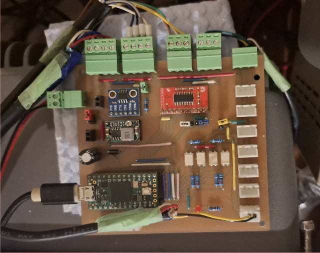

# teensyBoat.ino - Electronics

**[Home](readme.md)** -- **Electronics** -- **[3DP](3dp.md)**

repos: **[phorton1](https://github.com/phorton1)** --
**teensyBoat Firmware** --
**[teensyBoat App](https://github.com/phorton1/base-apps-teensyBoat/blob/master/docs/readme.md)** --
**[Boat Library](https://github.com/phorton1/Arduino-libraries-Boat/blob/master/docs/readme.md)** --
**[tbESP32 WiFi](https://github.com/phorton1/Arduino-boat-tbESP32/blob/master/docs/readme.md)** --
**[teensyWind Tester](https://github.com/phorton1/Arduino-boat-teensyWind/blob/master/docs/readme.md)** --
**[teensyGPS](https://github.com/phorton1/Arduino-boat-teensyGPS/blob/master/docs/readme.md)**

The teensyBoat PCB is a custom home-designed board for the Teensy 4.0.  It provides
all three marine protocol connections (Seatalk1 at 9-bit RS-232 levels, two NMEA 0183
ports via MAX3232, NMEA 2000 via CAN transceiver), the GP8 general-purpose connector
for ST50 instrument analog and pulse signals, and onboard power regulation.

TODO: insert photo of PCB mounted in enclosure here

## board2 -- Current Revision

The current PCB design.  KiCad schematic and layout files are in `docs/kicad/board2/`.
Gerber fabrication files have not yet been generated for this revision.

TODO: insert board2 schematic image here

TODO: insert board2 PCB layout image here

## board1 -- Previous Revision (Home-Milled)

The previous PCB revision, designed to be milled at home on a CNC router.  Full
design and fabrication pipeline is in `docs/kicad/board1/`:

- `board1.sch` / `board1.kicad_pcb` -- KiCad schematic and PCB layout
- `plot/` -- Gerber files for the copper layer, mask, and edge cuts
- `plot/gcode/` -- CNC milling gcode for the complete fabrication sequence:
  - `00-crosshair.gcode` -- reference crosshair for fixture alignment
  - `01-isolate.gcode` -- isolation routing of copper traces
  - `02-laser.gcode` -- laser marking of component silkscreen
  - `03-drill08.gcode` -- 0.8 mm through-hole drilling
  - `04-drill09.gcode` -- 0.9 mm through-hole drilling
  - `05-mill_holes.gcode` -- larger milled holes (connectors, mounting)
  - `06-cutout.gcode` -- board perimeter cutout

TODO: insert board1 schematic image here

TODO: insert board1 PCB layout image here

TODO: insert photo of freshly milled board1 PCB here

TODO: insert photo of assembled board1 PCB here

## Obsolete Revisions

Earlier design iterations are preserved in `docs/kicad/obs/` for reference:
`initial_board`, `max3232_board`, `board0_max3333`, `board0_relays`, `SeatalkJxn`,
and `ST50_Wind_Tester`.  These predate the current board architecture and are not
intended for fabrication.

---

**Next:** [3DP](3dp.md)
