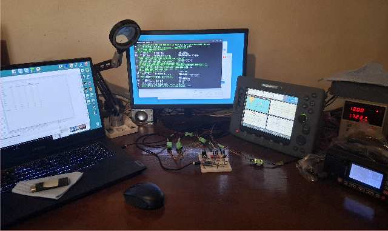

# teensyBoat.ino

**Home** --
**[Electronics](electronics.md)** --
**[3DP](3dp.md)** --
**[Commands](commands.md)**

repos: **[phorton1](https://github.com/phorton1)** --
**teensyBoat Firmware** --
**[teensyBoat App](https://github.com/phorton1/base-apps-teensyBoat/blob/master/docs/readme.md)** --
**[Boat Library](https://github.com/phorton1/Arduino-libraries-Boat/blob/master/docs/readme.md)** --
**[tbESP32 WiFi](https://github.com/phorton1/Arduino-boat-tbESP32/blob/master/docs/readme.md)** --
**[teensyWind Tester](https://github.com/phorton1/Arduino-boat-teensyWind/blob/master/docs/readme.md)** --
**[teensyGPS](https://github.com/phorton1/Arduino-boat-teensyGPS/blob/master/docs/readme.md)**

**teensyBoat.ino** is a Teensy 4.0 firmware and custom PCB that bridges three marine
instrument protocols -- **Seatalk1**, **NMEA 0183**, and **NMEA 2000** -- on a single
compact board.  It is the primary hardware in a three-repo marine electronics system
and the natural entry point for anyone exploring, building, or extending it.  The
firmware includes a complete **virtual boat simulator** and nine **virtual instrument
simulators** that can drive any combination of the three protocols, making it a
self-contained desktop test harness for Raymarine chartplotters and other marine
electronics.  A companion **GP8 connector** on the board drives the analog and pulse
inputs of Raymarine ST50 instruments directly, enabling bench testing of ST50 Speed,
Wind, and Depth instruments without a real boat or real transducers.

## The Three-Repo System

teensyBoat.ino is the hardware hub at the center of a tightly coupled three-repo system:

- **[Arduino-boat-teensyBoat](https://github.com/phorton1/Arduino-boat-teensyBoat)**
  (this repo) -- the Teensy 4.0 firmware and PCB.  Runs standalone as a protocol
  bridge and simulator; exposes a USB serial command interface for monitoring and control.

- **[base-apps-teensyBoat](https://github.com/phorton1/base-apps-teensyBoat)** --
  the companion wxPerl Windows desktop application.  Connects to the firmware over USB
  serial or UDP (via tbESP32) and provides real-time display of boat simulator state,
  live protocol monitoring, and virtual instrument configuration.

- **[Arduino-libraries-Boat](https://github.com/phorton1/Arduino-libraries-Boat)** --
  the shared C++ Arduino library included by the firmware.  Implements the virtual boat
  and instrument simulators, all three protocol stacks, the binary packet framing layer,
  and defines the packet type constants shared with the wxPerl application.

The three repos have independent git histories but are tightly coupled at the
protocol level.  The binary packet type constants defined in the Boat library must
match those in the wxPerl application's `tbBinary.pm`; they are kept in sync manually.

## Binary Serial Protocol

The firmware and wxPerl application communicate over a **binary packet protocol**
carried on the same USB serial port as text output -- or forwarded over UDP by the
**[tbESP32](https://github.com/phorton1/Arduino-boat-tbESP32)** WiFi bridge.
Both the text command interface and the binary telemetry stream are active simultaneously
on a single connection.

Every binary packet begins with a **0x02** start byte (BINARY_FLAG), followed by a
16-bit little-endian payload length and a 16-bit little-endian type code.  Multiple
streams can be active at once; the wxPerl application enables each stream it needs on
connect and disables them on close.

| Packet type         | Value  | Content                                              |
| ------------------- | ------ | ---------------------------------------------------- |
| BINARY_TYPE_PROG    | 0x0001 | Virtual instrument port-mask config and monitor flags |
| BINARY_TYPE_SIM     | 0x0002 | Full boat simulator state (50+ fields, at 1 Hz while running) |
| BINARY_TYPE_ST1     | 0x0010 | Decoded Seatalk1 datagrams from port ST1             |
| BINARY_TYPE_ST2     | 0x0020 | Decoded Seatalk1 datagrams from port ST2             |
| BINARY_TYPE_0183A   | 0x0100 | Raw NMEA 0183 sentences from port A                  |
| BINARY_TYPE_0183B   | 0x0200 | Raw NMEA 0183 sentences from port B                  |
| BINARY_TYPE_2000    | 0x1000 | Decoded NMEA 2000 PGN data                           |

The framing layer is implemented in `boatBinary.cpp` (`startBinary()` / `endBinary()`
in the Boat library) and consumed by the wxPerl application's binary receive loop.

## Hardware

The custom PCB and 3D-printed enclosure design files are included in this repository.

- **[Electronics](electronics.md)** -- KiCad schematics and PCB layouts for the current
  and previous board revisions, Gerber files, and CNC milling gcode for the home-milled
  board1 revision.

- **[3DP](3dp.md)** -- STL and 3MF files for the 3D-printed enclosure, and pre-sliced
  PETG printer gcode.

## Command Interface

The firmware accepts a comprehensive set of **text commands** -- plain
ASCII, case-insensitive, `KEY=VALUE` or `VERB` form, newline-terminated
-- on its USB serial port.  The same commands are forwarded by the
companion **tbESP32** WiFi bridge and by the **teensyBoat.pm** wxPerl
application's HTTP `/api/command` endpoint.

See **[Commands](commands.md)** for the complete reference: virtual boat
control, instrument configuration, protocol monitoring, GP8/ST50 testing,
NMEA 2000 device queries, and binary streaming control.

## Credits

- [**Paul Stoffregen**](https://www.pjrc.com/teensy/) --
  Creator of the Teensy microcontroller platform.  teensyBoat.ino is built
  for the Teensy 4.0.

- [**Thomas Knauf**](http://www.thomasknauf.de/seatalk.htm) --
  *SeaTalk Technical Reference Revision 3.23*.  The primary public reference for
  the Seatalk1 datagram protocol.  The
  **[Arduino Boat Library](https://github.com/phorton1/Arduino-libraries-Boat/blob/master/docs/readme.md)**
  used by this firmware builds on, extends, and in places corrects that work.
  Corrections, extensions, and new datagrams not in Knauf are catalogued on the
  **[Seatalk Knowledge](https://github.com/phorton1/Arduino-libraries-Boat/blob/master/docs/new_st_knowledge.md)**
  page in the Boat Library documentation.

## License

This software is released under the
[**GNU General Public License v3**](../LICENSE.TXT).

## Please Also See

- [**phorton1/base-apps-teensyBoat**](https://github.com/phorton1/base-apps-teensyBoat) --
  The companion wxPerl Windows application.  Monitors and controls the teensyBoat
  firmware over USB serial or WiFi; provides real-time display of simulator state,
  protocol monitoring, and virtual instrument configuration.

- [**phorton1/Arduino-libraries-Boat**](https://github.com/phorton1/Arduino-libraries-Boat) --
  The shared C++ library used by this firmware.  Implements the virtual boat and
  instrument simulators, all three protocol encoders and decoders, and the binary
  packet protocol shared with the wxPerl application.

- [**phorton1/Arduino-boat-teensyGPS**](https://github.com/phorton1/Arduino-boat-teensyGPS) --
  A related device built on the same Boat library: a Teensy/Neo6M GPS that outputs
  Seatalk1 and/or NMEA 2000 for integration into an existing marine instrument network.

- [**phorton1/Arduino-boat-tbESP32**](https://github.com/phorton1/Arduino-boat-tbESP32) --
  The ESP32 WiFi bridge that plugs into teensyBoat's GP8 connector, forwarding the
  USB serial binary protocol over UDP to the wxPerl application over a local network.

- [**phorton1/Arduino-boat-teensyWind**](https://github.com/phorton1/Arduino-boat-teensyWind) --
  A companion device that interfaces directly with a Raymarine ST50/ST60 wind vane
  transducer and outputs Seatalk1 or NMEA 2000.

- [**phorton1/base-apps-raymarine**](https://github.com/phorton1/base-apps-raymarine) --
  Documentation of the reverse-engineered Raymarine SeatalkHS ethernet protocol
  suite.  The teensyBoat hardware was the active instrument platform during that work.

---

**Next:** [Electronics](electronics.md)
